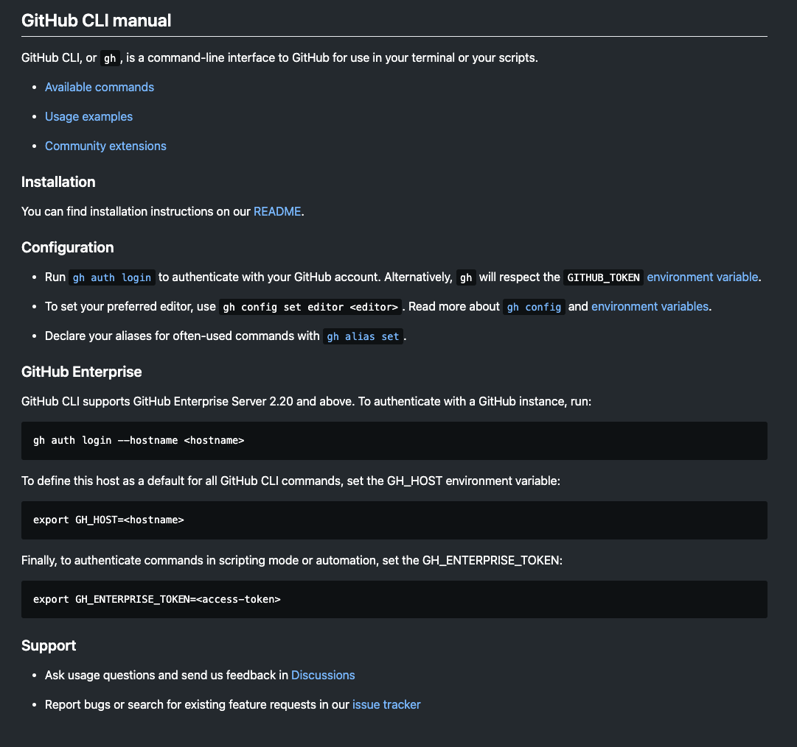

# transfer

**run GitHub Auth**
- gh auth login

`git commit -am "commit note"`    (create a commit with message)

`git add .`                       (adds everything within the folder)

`git push origin main`            (pushes updates to main)
